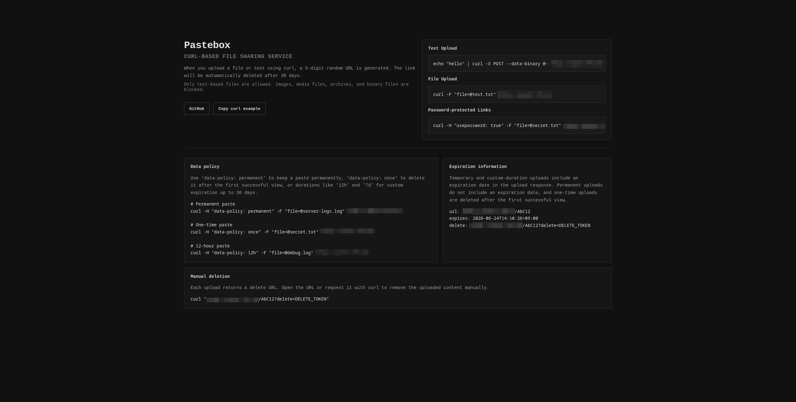
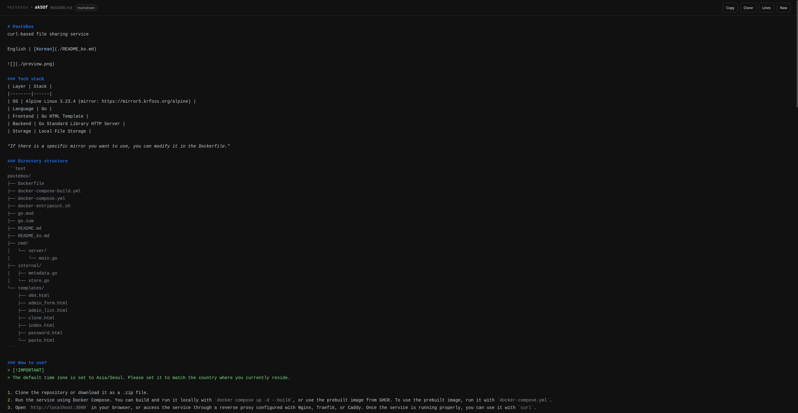
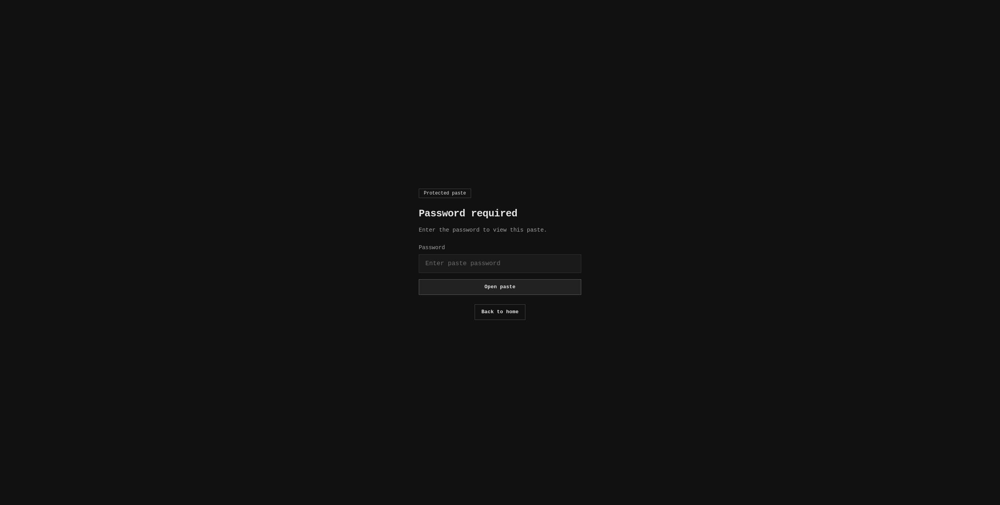
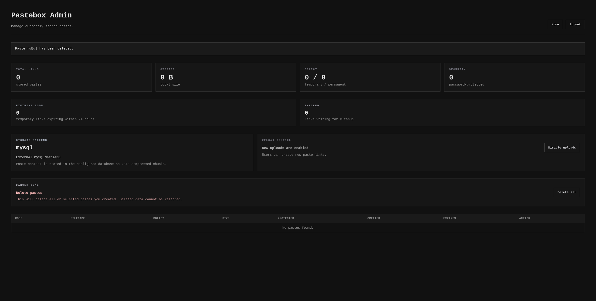
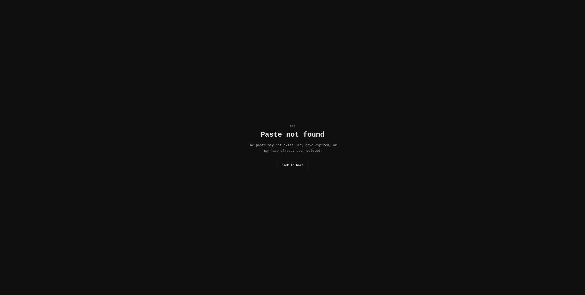

# Pastebox
curl-based file sharing service

English | [Korean](./README_ko.md)



<details>
<summary>Previews</summary>

### Paste



### Password-protected



### Admin Page



### 404


</details>

### Tech stack
| Layer | Stack |
|--------|------|
| OS | Alpine Linux 3.24.1 (mirror: https://mirror5.krfoss.org/alpine) |
| Language | Go 1.26.4 |
| Frontend | Go HTML Template |
| Backend | Go Standard Library HTTP Server |
| Storage | Local / MySQL & MariaDB |

*If there is a specific mirror you want to use, you can modify it in the Dockerfile.*

### Directory structure
```text
pastebox/
├── .github/
│   └── workflows/
│       ├── docker-publish.yml
│       └── release.yml
├── AGENTS.md
├── DATA_POLICY.md
├── DATA_POLICY_ko.md
├── Dockerfile
├── LICENSE
├── README.md
├── README_ko.md
├── 404.png
├── admin.png
├── docker-compose-build.yml
├── docker-compose.yml
├── docker-entrypoint.sh
├── go.mod
├── go.sum
├── main.png
├── paste.png
├── password-protected.png
├── cmd/
│   └── server/
│       ├── admin.go
│       ├── app.go
│       ├── auth.go
│       ├── handler_clone.go
│       ├── handler_index.go
│       ├── handler_manage.go
│       ├── handler_paste.go
│       ├── handler_upload.go
│       ├── i18n.go
│       ├── logging.go
│       ├── main.go
│       ├── main_test.go
│       ├── routes.go
│       ├── upload_validation.go
│       └── util.go
├── internal/
│   ├── admin_store.go
│   ├── locks.go
│   ├── metadata.go
│   ├── mysql_store.go
│   ├── secrets.go
│   ├── store.go
│   ├── store_local.go
│   └── store_test.go
├── locales/
│   ├── en.json
│   └── ko.json
└── templates/
    ├── 404.html
    ├── admin_form.html
    ├── admin_list.html
    ├── admin_reset.html
    ├── clone.html
    ├── index.html
    ├── manage.html
    ├── password.html
    └── paste.html
```

### How to use?
> [!IMPORTANT]
> The default time zone is set to Asia/Seoul. Please set it to match the country where you currently reside.

1. Clone the repository or download it as a .zip file.
2. Run the service using Docker Compose. You can build and run it locally with `docker compose up -d --build`, or use the prebuilt image from GHCR. To use the prebuilt image, run it with `docker-compose.yml`.
3. Open `http://localhost:3000` in your browser, or access the service through a reverse proxy configured with Nginx, Traefik, or Caddy. Once the service is running properly, you can use it with `curl`.

### Storage backend
Pastebox supports `local` and `mysql` storage backends. Use `local` for local file storage, or use `mysql` for an external MySQL & MariaDB database.

| Variable | Default | Description |
|----------|---------|-------------|
| `STORAGE_BACKEND` | `local` | Paste storage backend. Use `local` for `/paste-data` files or `mysql` for an external MySQL & MariaDB database. |
| `MYSQL_DSN` | empty | Required when `STORAGE_BACKEND=mysql`. Keep `parseTime=true` and `utf8mb4` options for compatibility. |
| `DB_ZSTD_LEVEL` | `3` | Optional zstd compression level for DB-mode paste content. |
| `MIGRATE_LOCAL_PASTES` | `false` | When `STORAGE_BACKEND=mysql`, migrate existing local paste files into MySQL during startup. This is a one-time migration: once it succeeds, Pastebox records completion in SQLite and skips it on later restarts. |
| `MIGRATE_SQLITE_ADMIN_ACCOUNTS` | `false` | When `STORAGE_BACKEND=mysql`, migrate the existing SQLite admin account, admin sessions, and admin settings into MySQL during startup. This is a one-time migration: once it succeeds, Pastebox records completion in SQLite and skips it on later restarts. |

Example MySQL & MariaDB configuration:

```yaml
environment:
  STORAGE_BACKEND: "mysql"
  MYSQL_DSN: "pastebox:pastebox@tcp(mysql.example.com:3306)/pastebox?parseTime=true&charset=utf8mb4&collation=utf8mb4_unicode_ci"
  DB_ZSTD_LEVEL: "3"
  MIGRATE_LOCAL_PASTES: "true"
  MIGRATE_SQLITE_ADMIN_ACCOUNTS: "true"
```

In `local` mode, paste content is stored under `DATA_DIR` with JSON sidecar metadata. In `mysql` mode, paste content, the admin account, admin sessions, and admin settings are stored in the configured MySQL or MariaDB database. SQLite at `/paste-data/pastebox.db` remains in use only for migration completion markers.

The two migration flags are startup-only helpers for moving an existing local installation into MySQL:

- `MIGRATE_LOCAL_PASTES=true` scans `DATA_DIR` for local paste files and their JSON sidecars, copies each paste into MySQL, then removes the local file pair after each successful copy.
- `MIGRATE_SQLITE_ADMIN_ACCOUNTS=true` copies the existing SQLite admin account, admin sessions, and admin settings into MySQL, then removes the migrated SQLite rows after success. Migration completion markers remain in SQLite.

Both migrations are protected by a completion marker stored in SQLite under `pastebox_settings`. After a migration finishes successfully, later restarts skip it. If a migration fails before the marker is written, Pastebox will try again on the next startup.

### Features
> [!NOTE]
> **DON'T FORGET TO REPLACE `localhost` WITH THE DOMAIN OR IP ADDRESS YOU'RE CURRENTLY USING.**

1. **Automatic File Deletion**: Uploaded files are automatically deleted 30 days after upload.

2. **Text Upload**: You can upload text directly by combining Pastebox with Linux commands such as **echo** and **cat (cat << EOF)**.

   ```bash
   echo "hello" | curl -X POST --data-binary @- http://localhost:8080/
   ```

3. **File Upload**: Supports file uploads using the `multipart/form-data` format.

   ```bash
   curl -F "file=@test.txt" http://localhost:8080/
   ```

4. **Permanent Storage**: Use the `data-policy: permanent` header to exclude an uploaded file from automatic deletion and store it permanently.

   ```bash
   curl -H "data-policy: permanent" -F "file=@test.txt" http://localhost:8080/
   ```
    
   ```json
   // Storage path: ./data/code.json

   {
     "id": "code",
     "created_at": "2026-05-25T06:46:51.108540924Z",
     "expires_at": "0001-01-01T00:00:00Z",
     "data_policy": "permanent",
     "size": 5,
     "content_type": "application/octet-stream"
   }
   ```

5. **One-time storage**: When the `data-policy: once` header is used, the data is stored only once and is automatically deleted once the user has confirmed it.

   ```bash
   curl -H "data-policy: once" -F "file=@test.txt" http://localhost:8080/
   ```

   ```json
   {
    "id": "code",
    "delete_token_hash": "yourDeleteToken",
    "created_at": "2026-05-26T11:11:09.799454368Z",
    "expires_at": "2026-06-25T11:11:09.799454368Z",
    "data_policy": "once",
    "size": 6,
    "content_type": "text/plain; charset=utf-8"
   }
   ```

6. **Expiration Information**: Temporary uploads include an `expires` field in the response so you can check when the file will expire. If `data-policy: permanent` is used, the expiration date is not shown.

   ```
   url: http://localhost:8080/RANDOM_CODE
   expires: 2026-06-24T05:10:26Z
   delete: http://localhost:8080/RANDOM_CODE?delete=DELETE_TOKEN
   ```

7. **Manual Deletion**: Each upload returns a delete URL. You can use this URL to manually delete the uploaded file. Deletion requests are also recorded in the container logs.

   ```bash
   curl "http://localhost:8080/RANDOM_CODE?delete=DELETE_TOKEN"
   ```

8. **Password-Protected Links**: Private upload link creation using the `usepassword: true` header is supported. When this header is used, an 8-character password is issued, generated from a combination of uppercase English letters, lowercase English letters, numbers, and special characters. Files can be viewed directly using the `?password=...` query parameter or the `paste-password: ...` header, or by entering the password manually when accessing the link in a browser.

   ```bash
   # Create password-protected link
   curl -H "usepassword: true" -F "file=@secret.txt" http://localhost:8080/

   # View file: header method
   curl -H "paste-password: RANDOM_PASSWORD" http://localhost:8080/RANDOM_CODE

   # View file: query parameter method
   curl "http://localhost:8080/RANDOM_CODE?password=RANDOM_PASSWORD"
   ```

9. **Custom Code**: You can use the `code: ...` header to create a link with a code of your choice instead of a randomly generated code. **Uppercase and lowercase English letters, numbers, and the special characters `_` and `-` are supported.** Codes longer than 10 characters or duplicate codes cannot be created.

   ```bash
   curl -H "code: custom123" -F "file=@secret.txt" http://localhost:8080/
   ```

10. **Upload Response Format**: When an upload succeeds, Pastebox returns the URL, expiration time, and delete link. If the upload is password-protected, the `password` field is also included.

   ```
   url: http://localhost:8080/RANDOM_CODE
   expires: 2026-06-24T05:10:26Z
   password: RANDOM_PASSWORD
   manage: http://localhost:8080/RANDOM_CODE?manage=MANAGE_TOKEN
   delete: http://localhost:8080/RANDOM_CODE?delete=DELETE_TOKEN
   ```

   If you need a JSON response for parsing by scripts or other tools, append `?format=json` to the upload request:

   ```bash
   curl -F "file=@test.txt" "http://localhost:8080/?format=json"
   ```

   ```json
   {
     "url": "http://localhost:8080/RANDOM_CODE",
     "expires": "2026-06-24T05:10:26Z",
     "password": "RANDOM_PASSWORD",
     "manage": "http://localhost:8080/RANDOM_CODE?manage=MANAGE_TOKEN",
     "delete": "http://localhost:8080/RANDOM_CODE?delete=DELETE_TOKEN"
   }
   ```

11. **Paste Management Link**: Each successful upload now also generates a private management URL. The link is delivered as a query parameter in the upload response using `?manage=...`. Anyone with that token can access the management page directly without entering a password. Later requests must continue to include the same `manage` token in the URL.

   The management link can be used to:

   - switch between public and password-protected access
   - change the retention policy
   - delete the paste

   When converting a password-protected paste back to public, Pastebox requires the current generated password for verification first.

12. **Copy Content in Browser**: When opening a text-based upload link in the browser, you can copy the content to your clipboard using the `Copy` button next to the `Raw` button.

13. **Text File Rendering in Browser**: Text-based files such as `.txt` and `.log` are displayed directly in the browser instead of being downloaded. If you need the original raw response, use `?format=raw`.

14. **Creation and Deletion Logs**: File creation and deletion events are recorded in the container logs.

   ```
   created: id=AbC12 remote=127.0.0.1:51234 size=123 content_type="text/plain; charset=utf-8" policy=temporary expires=2026-06-24T05:10:26Z protected=false
   deleted: id=AbC12 remote=127.0.0.1:51234
   ```

15. **Fine-Grained Lock Manager**: Pastebox applies locks per upload ID to reduce conflicts when viewing, deleting, or cleaning up the same file concurrently. Different files can still be processed in parallel.

16. **Admin Page**: You can access the admin page by adding `/admin` after the IP address or domain. If no account exists, the first created account becomes the administrator account, and additional account creation is disabled afterward. When `STORAGE_BACKEND=mysql`, the admin account, admin sessions, and admin settings are stored in MySQL. SQLite at `/paste-data/pastebox.db` inside the container, or `./data/pastebox.db` on the host, is then used only for migration completion markers. Passwords are stored in hashed form. The admin dashboard shows paste counts, storage usage, policy breakdown, expiring and expired items, and the current paste storage backend. It also lets administrators enable or disable uploads, delete a single paste, or bulk-delete selected pastes.

17. **Admin Password Reset**: If you lose the admin password, set `ADMIN_RESET_TOKEN` in `docker-compose-build.yml` (or `docker-compose.yml`), restart the container, and open `/admin/reset`. Enter the reset token and a new password. After reset, existing admin sessions are invalidated and you must log in again with the new password.

18. **Admin Manage Page**: Every successful upload also gets a private manage URL using `?manage=...`. The manage page lets you copy the public URL and manage URL, switch between public and password-protected access, change the retention policy, and delete the paste. If a password-protected paste is converted back to public, Pastebox first asks for the current generated password.

19. **Syntax Highlighting Support**: Syntax highlighting is supported for common text formats including `.txt`, `.md`, `.log`, `.csv`, `.conf`, `.yaml`, `.toml`, `.go`, `.rs`, `.js`, `.py`, `.ts`, `.php`, `.html`, `.css`, `.sql`, `.lua`, and shell scripts such as `.sh`. `Dockerfile`, `*.Dockerfile`, `Makefile`, `.env.example`, `.gitignore`, `compose.yaml`, `compose.yml`, `docker-compose.yaml`, `docker-compose.yml`, `nginx.conf`, and `*.nginx.conf` are also detected by filename.

20. **Long-line Wrap Mode**: When a paste contains a very long single line, the view page shows a `Long line detected` hint and provides a `Wrap` button so you can switch from horizontal scrolling to wrapped reading mode in the browser.

21. **Paste Clone**: You can clone the current paste into a new link by clicking the `Clone` button on the view page.

### Data Policy
For details about the data policy header, see [DATA_POLICY.md](./DATA_POLICY.md)
